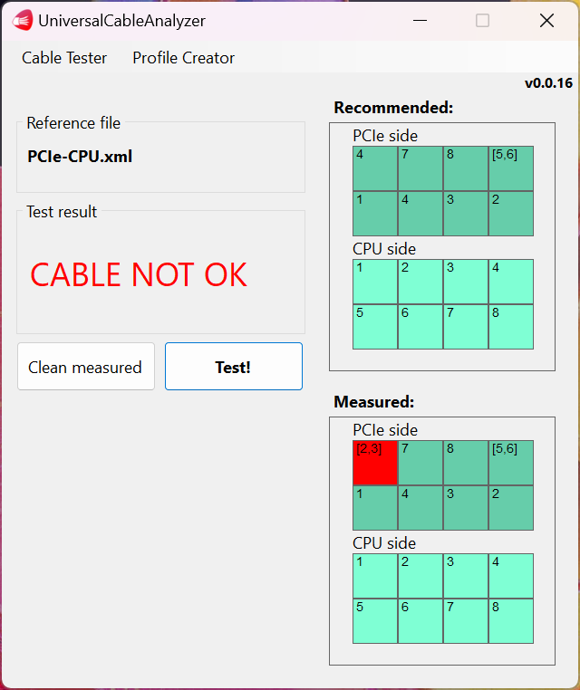

# Cable connection tester software
A software application that checks the continuity and the order of the wires within a cable to ensure there are no breaks and that the wires are correctly seated. It receives measurement results from the [UniversalCableTesterBoard](https://github.com/Tamas-Biro1/UniversalCableTesterBoard) via a serial interface and then compares these results with an XML schema file for the specific cable. If an exact match is found, the cable is considered OK. If there is a faulty connection, the software indicates which pin has no connection to the other connector but should, or if there is a connection where there shouldn't be.

<p align="center">
  
</p>

# Example
Here is an example of a PCIe 8 Pin Female to PCIe 8 (6+2) Pin Male (motherboard to graphics card) cable:
```
<RESULT,8,64,128,48,1,8,4,2,0,0,0,0,0,0,0,0,0,0,0,0,0,0,0,0,0,0,0,0,0,0,0,0>
```

The above result indicates that the connector where the hardware sent the probes has 8 pins on the probe side (the number of values that are not 0). The first pin (received value 8) is connected to pin number 4 on the other side (0000 1000). The fourth pin (value 48) is connected to pin numbers 5 and 6 (0011 0000).
 
 # Future improvements
The cable profile XMLs have color elements where the wire color can be stored in its hexadecimal code.

 # Contributing
 All contributions and feedback are warmly welcomed. The code might not be perfect, so any help is much appreciated.

 # Licensing
 This project is licensed under the GNU GPLv3 License - see the LICENSE file for details.


